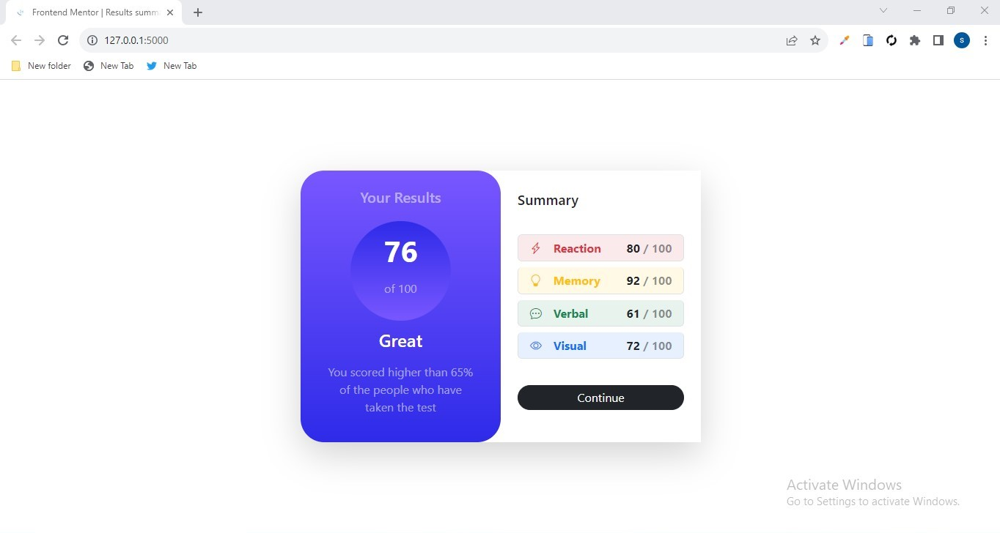

## Table of contents

- [Overview](#overview)
  - [The challenge](#the-challenge)
  - [Screenshot](#screenshot)
  - [Links](#links)
- [My process](#my-process)
  - [Built with](#built-with)
  - [What I learned](#what-i-learned)
  - [Useful resources](#useful-resources)
- [Author](#author)

## Overview

### The challenge

Users should be able to:

- View the optimal layout for the interface depending on their device's screen size
- See hover and focus states for all interactive elements on the page
- **Bonus**: Use the local JSON data to dynamically populate the content

### Screenshot

### Links

- Solution URL: [solution](https://github.com/akinwumi-sa/result-summary)
- Live Site URL: [result summary](https://your-live-site-url.com)

## My process

### Built with

- Semantic HTML5 markup
- CSS custom properties
- Flexbox
- Mobile-first workflow
- [Flask](https://flask.palletsprojects.com/) - Python web framework
- [Bootstrap5](https://getbootstrap.com/) - For styles

### What I learned

- How to create a flask app, i was able to learn about jinja templating and how i can use it render html pages on my website
- I learnt how to usethe json module inbuilt in python to dynamically render its data on the website

### Useful resources

- [Bootstrap5 documentation](https://www.getbootstrap.com) - This helped me for XYZ reason. I really liked this pattern and will use it going forward.
- [Flask documentation](https://www.https://flask.palletsprojects.com/en/2.3x) - This is an amazing documentation with a good easy to start tutorial which helped me finally understand creating my first server. I'd recommend it to anyone still learning this concept.

## Author

- Website - [Akinola Samuel](https://)
- Frontend Mentor - [@akinwumi-sa](https://www.frontendmentor.io/profile/akinwumi-sa)
- Twitter - [@akinwumi_sa](https://www.twitter.com/akinwumi_sa)
